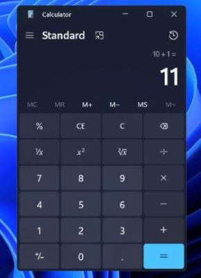

# Windows calculator replica (from wish!)

## How to use:

```bash
git clone https://github.com/Pedram-Naghib/replica-calc.git
cd windows-calc-replica
python run.py
```

**Important**

Comment out [this line](https://github.com/Pedram-Naghib/replica-calc/blob/ba8c67cc29d218b37c578c5b1a2b697c5cf87940/src/calc.py#L6) if you are on linux or mac.

Here is orginal windows calculator and its replica for comparison:




Can't say which is which, Right?
