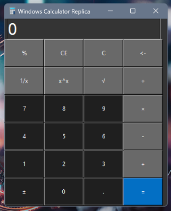

# :calculator: Windows calculator replica (from wish!)

## How to use:

```bash
git clone https://github.com/Pedram-Naghib/replica-calc.git
cd windows-calc-replica
python run.py
```

Here is orginal windows calculator and its replica for comparison:



Can't say which is which, Right?
